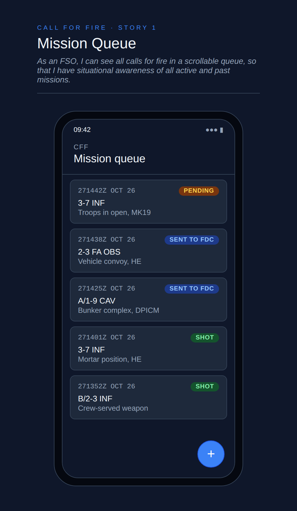

# Call for Fire Tool User Stories

## Story #1: Mission Queue

Type: **feature**

_As an FSO, I can see all calls for fire in a scrollable queue so that I have situational awareness of all active and
past missions._

### Design 


### Acceptance Criteria

```gherkin
Scenario: Display logged fire missions

Given at least one mission has been logged
When I open the application
Then I see a scrollable list of missions ordered newest first
And each row shows the DTG, observer ID, and status
```

```gherkin
Scenario: Empty queue

Given no missions have been logged
When I open the application
Then I see the message "No missions logged"
```

```gherkin
Scenario: Status Badge Colors

Given a mission with status "Pending" exists
When I view the queue
Then the status badge is amber

Given a mission with status "Sent to FDC" exists
When I view the queue
Then the status badge is blue

Given a mission with status "Shot" exists
When I view the queue
Then the status badge is green
```
